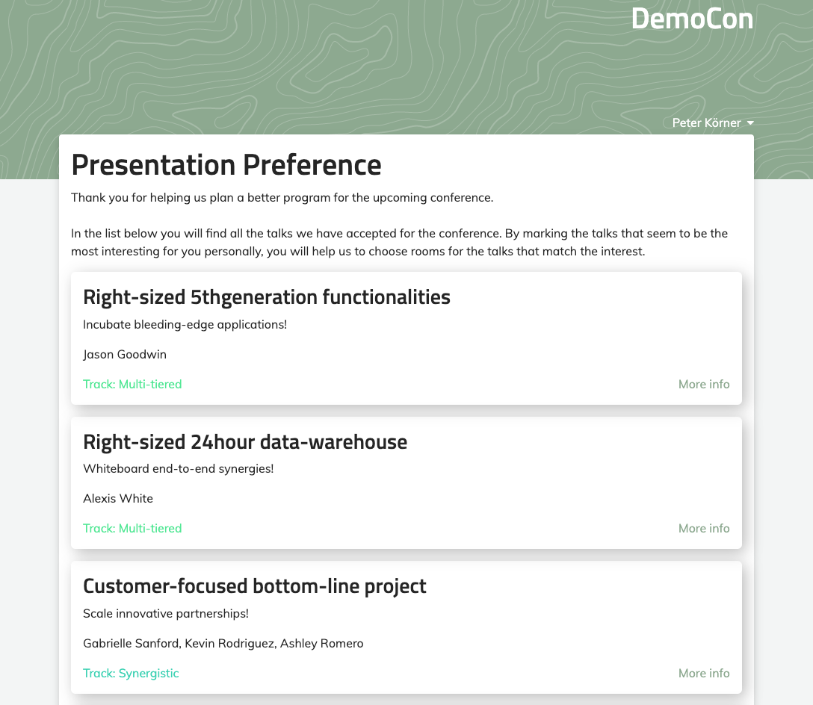
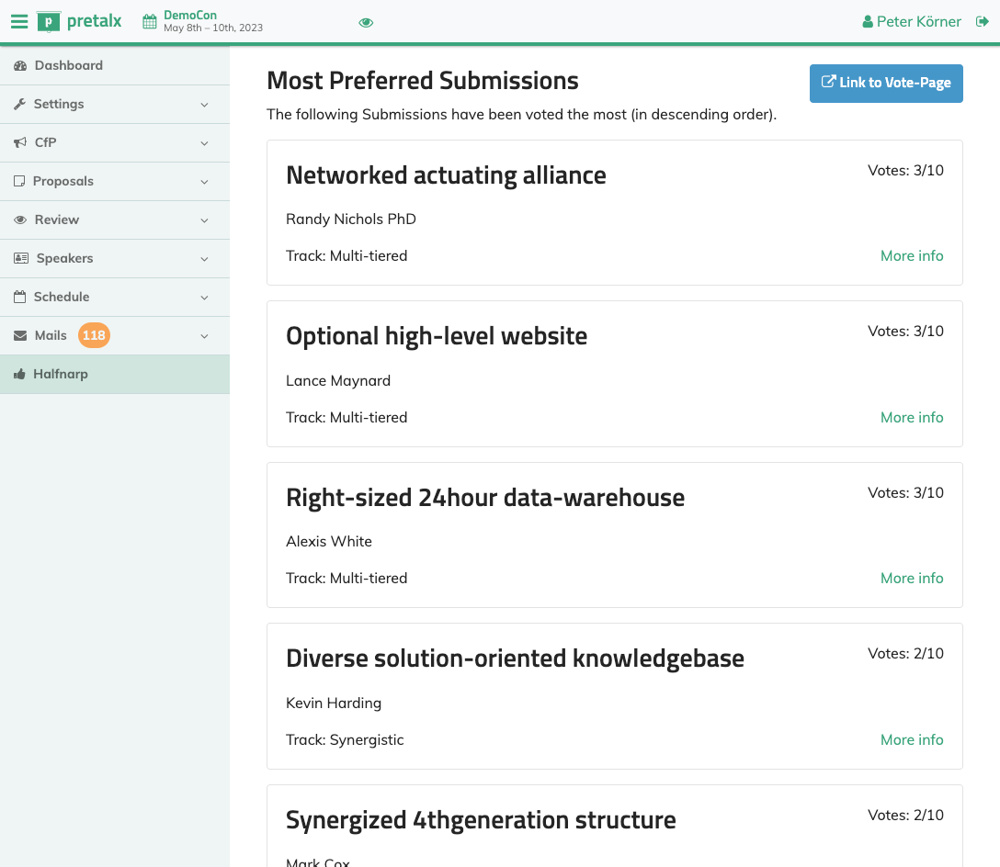

Pretalx-Halfnarp
==========================

Pretalx-Halfnarp is a Plugin that helps you to estimate the interest in your submissions and plan
room-sizes accordingly by scheduling the most requested submissions into the larger rooms.

It presents a Voting-Interface to visitors, where they can pick their most favourite submissions.
All submissions in the "Accepted" and "Confirmed" state are shown, so that you can use Halfnarp
before beginning to plan your schedule. The order of the submissions is randomized per viewer to
avoid a bias towards the top results.

Halfnarp is an anagram of Fahrplan, a not-yet sorted Fahrplan

Screenshots
-----------

Development setup
-----------------

1. Make sure that you have a working `pretalx development setup`_.

2. Clone this repository, eg to ``local/pretalx-halfnarp``.

3. Activate the virtual environment you use for pretalx development.

4. Execute ``pip install -e .`` within this directory to register this application with pretalx's plugin registry.

5. Execute ``make`` within this directory to compile translations.

6. Restart your local pretalx server. You can now use the plugin from this repository for your events by enabling it in
   the 'plugins' tab in the settings.

License
-------

Copyright 2023 Peter Körner

Released under the terms of the Apache License 2.0

.. _pretalx: https://github.com/pretalx/pretalx
.. _pretalx development setup: https://docs.pretalx.org/en/latest/developer/setup.html
